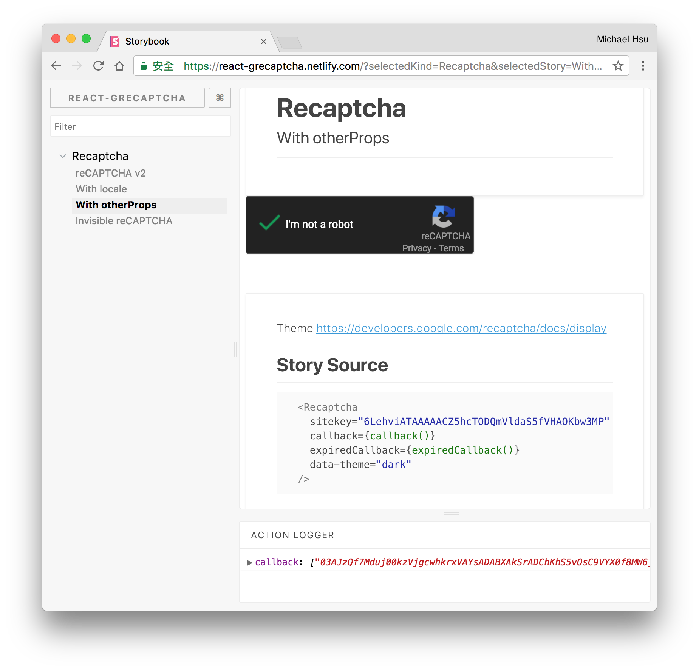

# react-grecaptcha

> React.js Google reCAPTCHA v2 integration component.

[![Travis][build-badge]][build] 
[![Codecov Status][codecov-badge]][codecov] 
[![npm package][npm-badge]][npm] 
[![npm downloads][npm-downloads]][npm] 
[![node][node]]()

[![Dependency Status][dependency-badge]][dependency]
[![devDependency Status][devDependency-badge]][devDependency]
[![peerDependency Status][peerDependency-badge]][peerDependency]

[![Greenkeeper badge][greenkeeper-badge]][greenkeeper]
[![prettier][prettier-badge]][prettier]
[![license][license-badge]][license]

## Feature

1. Isomorphic support. (Only render on client side.)
2. Lazy load scripts for routing.
3. Automatically render the reCAPTCHA widget.
4. I18n support. https://developers.google.com/recaptcha/docs/language
5. Simple to use.

## Demo

1. Storybook: [react-grecaptcha.netlify.com](https://react-grecaptcha.netlify.com)
2. Webpackbin: [webpackbin.com/bins/-KjCPM_MB-WIp-vxaBCy](https://www.webpackbin.com/bins/-KjCPM_MB-WIp-vxaBCy)

[](https://react-grecaptcha.netlify.com)

## Installation

```console
$ yarn add react-grecaptcha
```

## Usage

```js
import Recaptcha from 'react-grecaptcha';

const verifyCallback = response => console.log(response);
const expiredCallback = () => {...};

<Recaptcha
  sitekey={RECAPTCHA_SITE_KEY}
  callback={verifyCallback}
  expiredCallback={expiredCallback}
  locale="zh-TW"
  className="customClassName"
  
  // Other props will be passed into the component.
  data-theme="dark"
/>
```

## API

- To reset the recaptcha:

```js
window.grecaptcha.reset();

// You can use other functions the same way.
window.grecaptcha.execute
window.grecaptcha.getResponse
window.grecaptcha.render
...
```

## Development

### Requirements

-   node >= 8.7.0
-   npm >= 5.4.2
-   yarn >= 1.2.1

```
$ yarn install --pure-lockfile
$ yarn start
```

## Test

```
$ yarn run format
$ yarn run eslint
$ yarn run test:watch
$ yarn run build
$ yarn run build-storybook
```

---

## CONTRIBUTING

* ⇄ Pull requests and ★ Stars are always welcome.
* For bugs and feature requests, please create an issue.
* Pull requests must be accompanied by passing automated tests (`$ yarn test`).

## [CHANGELOG](CHANGELOG.md)

## [LICENSE](LICENSE)

MIT: [http://michaelhsu.mit-license.org](http://michaelhsu.mit-license.org)

[build-badge]: https://img.shields.io/travis/evenchange4/react-grecaptcha/master.svg?style=flat-square
[build]: https://travis-ci.org/evenchange4/react-grecaptcha
[npm-badge]: https://img.shields.io/npm/v/react-grecaptcha.svg?style=flat-square
[npm]: https://www.npmjs.org/package/react-grecaptcha
[codecov-badge]: https://img.shields.io/codecov/c/github/evenchange4/react-grecaptcha.svg?style=flat-square
[codecov]: https://codecov.io/github/evenchange4/react-grecaptcha?branch=master
[node]: https://img.shields.io/node/v/react-grecaptcha.svg?style=flat-square
[npm-downloads]: https://img.shields.io/npm/dt/react-grecaptcha.svg?style=flat-square
[license-badge]: https://img.shields.io/npm/l/react-grecaptcha.svg?style=flat-square
[license]: http://michaelhsu.mit-license.org/
[dependency-badge]: https://david-dm.org/evenchange4/react-grecaptcha.svg?style=flat-square
[dependency]: https://david-dm.org/evenchange4/react-grecaptcha
[devDependency-badge]: https://david-dm.org/evenchange4/react-grecaptcha/dev-status.svg?style=flat-square
[devDependency]: https://david-dm.org/evenchange4/react-grecaptcha#info=devDependencies
[peerDependency-badge]: https://david-dm.org/evenchange4/react-grecaptcha/peer-status.svg?style=flat-square
[peerDependency]: https://david-dm.org/evenchange4/react-grecaptcha#info=peerDependencies
[greenkeeper-badge]: https://badges.greenkeeper.io/evenchange4/react-grecaptcha.svg?style=flat-square
[greenkeeper]: https://greenkeeper.io/
[prettier-badge]: https://img.shields.io/badge/styled_with-prettier-ff69b4.svg?style=flat-square
[prettier]: https://github.com/prettier/prettier
